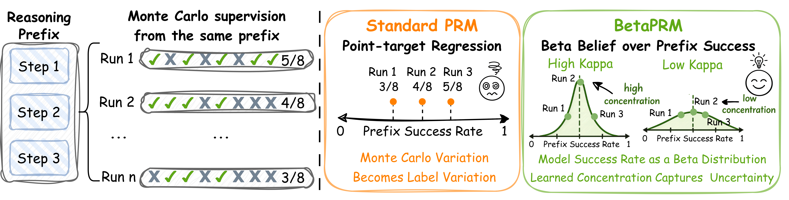
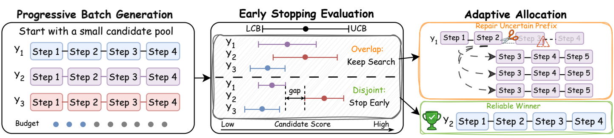

# Beta-Binomial-PRM

This repository provides the training, evaluation, and ACA inference code for the Beta-Binomial Process Reward Model (PRM) based on InternVL.



Beta-Binomial PRM is designed for Monte Carlo step supervision. For each reasoning prefix, the data records how many of `N` sampled continuations reach the correct final answer. Instead of treating the empirical ratio `K/N` as an exact point label, Beta-Binomial PRM predicts a Beta distribution over the prefix success probability and trains it to explain the observed count `K`.

The Beta mean `mu` is used as the usual PRM score, while the concentration `kappa` measures how reliable that score is. High concentration gives a sharp, confident belief; low concentration gives a flatter belief that can account for noisier Monte Carlo observations.

## ⚡️ Quickstart Guide

### 1. Configure Environment

```bash
git clone https://github.com/JinyuanLi0012/Beta-Binomial-PRM.git
cd Beta-Binomial-PRM

conda create -n beta-binom-prm python=3.10 -y
conda activate beta-binom-prm

pip install uv
uv pip install -r requirements.txt
```

By default, the training script uses `OpenGVLab/InternVL2_5-8B` with DeepSpeed ZeRO-3. You can override `MODEL_PATH` if using a local checkpoint.

### 2. Data Prepare

Download the processed Beta-Binomial PRM training annotation file:

- Google Drive: [https://drive.google.com/file/d/1CDTXd321Cl7FLwGKq0SiKSBvAX_LWYZ-/view?usp=sharing](https://drive.google.com/file/d/1CDTXd321Cl7FLwGKq0SiKSBvAX_LWYZ-/view?usp=sharing)

Place it at:

```bash
datasets/Beta-Binomial-project/all_combined_beta_binom.jsonl
```

The annotation file references VisualPRM400K images, so also place the image folders under:

```bash
datasets/VisualPRM400K-v1.1-Raw/
```

After preparation, the data directory should look like:

```bash
datasets/
  Beta-Binomial-project/
    all_combined_beta_binom.jsonl
  VisualPRM400K-v1.1-Raw/
    ai2d/
    chartqa/
    ...
```

The default meta file `shell/data/meta_visualprm400k_beta_binom.json` already points to this layout. No extra data conversion step is required.

### 3. Model Training

We provide a ready-to-run training script `shell/scripts/visualprm400k_train_beta_binom.sh`.
By default, it reads the dataset meta config from `shell/data/meta_visualprm400k_beta_binom.json`
and trains an InternVL2.5 model with DeepSpeed ZeRO-3 (`configs/zero_stage3_config.json`).

The default parameters are suitable for 4 GPUs with at least 80GB of memory.

```bash
bash shell/scripts/visualprm400k_train_beta_binom.sh
```

### 4. Build Evaluation Rollouts

For PRM evaluation, first generate `N=16` reasoning rollouts for each question and use an OpenAI-compatible vLLM judge server to label each final answer as correct or incorrect.

Download the prepared evaluation seed datasets:

- Google Drive: [https://drive.google.com/file/d/1M8L7avoSlofRW0cbIDYo5weMttC5sI7L/view?usp=sharing](https://drive.google.com/file/d/1M8L7avoSlofRW0cbIDYo5weMttC5sI7L/view?usp=sharing)

Unzip it under the repository root:

```bash
unzip eval_seed_datasets.zip -d .
```

Start a judge model server separately, for example with `Qwen2.5-32B-Instruct`:

```bash
python data_pipeline/start_vllm_server.py \
  --model Qwen/Qwen2.5-32B-Instruct \
  --host 127.0.0.1 \
  --port 8888 \
  --served-model-name Qwen2.5-32B-Instruct \
  --max-model-len 6000
```

For MathVision, MathVerse, and MathVista, use the single-image rollout builder:

```bash
CUDA_VISIBLE_DEVICES=0 python -m eval.build_eval_rollouts_annotation \
  --input datasets/MathVision/seed_dataset.json \
  --output datasets/MathVision/MathVision_rollout_annotation_InternVL8B_oversample.json \
  --image_root datasets/MathVision \
  --generator_model OpenGVLab/InternVL2_5-8B \
  --num_rollouts 16 \
  --judge_api_base http://127.0.0.1:8888/v1 \
  --judge_model Qwen2.5-32B-Instruct \
  --select_by_llm_quality \
  --oversample 2.0
```

For OlympiadBench, use the multi-image rollout builder:

```bash
CUDA_VISIBLE_DEVICES=0 python -m eval.build_eval_rollouts_annotation_olympiadbench \
  --input datasets/OlympiadBench/seed_dataset.json \
  --output datasets/OlympiadBench/OlympiadBench_rollout_annotation_InternVL8B_oversample.json \
  --image_root datasets/OlympiadBench \
  --generator_model OpenGVLab/InternVL2_5-8B \
  --num_rollouts 16 \
  --judge_api_base http://127.0.0.1:8888/v1 \
  --judge_model Qwen2.5-32B-Instruct \
  --select_by_llm_quality \
  --oversample 2.0
```

### 5. Evaluate PRM Checkpoints

After building rollout annotations, evaluate a Beta-Binomial PRM checkpoint with `torchrun`.
The evaluator writes PRM scores and also runs an uncertainty diagnosis sweep by default.

Example for MathVista:

```bash
PYTHONPATH="$(pwd)/src:$(pwd):${PYTHONPATH}" \
CUDA_VISIBLE_DEVICES=0,1,2,3 torchrun \
  --nnodes=1 \
  --node_rank=0 \
  --master_addr=127.0.0.1 \
  --nproc_per_node=4 \
  --master_port=63669 \
  eval/prm/evaluate_mathvista_prm_beta_binomial.py \
  --checkpoint /path/to/beta-binomial-prm-checkpoint \
  --datasets mathvista_prm \
  --out-dir /path/to/output_dir \
  --score-mode mu_minus_lambda_sigma
```

Use the corresponding evaluator and dataset name for other benchmarks:

```text
MathVision:    eval/prm/evaluate_mathvision_prm_beta_binomial.py      --datasets mathvision_prm
MathVerse:     eval/prm/evaluate_mathverse_prm_beta_binomial.py       --datasets mathverse_prm
MathVista:     eval/prm/evaluate_mathvista_prm_beta_binomial.py       --datasets mathvista_prm
OlympiadBench: eval/prm/evaluate_olympiadbench_prm_beta_binomial.py   --datasets olympiadbench_prm
```

### 6. ACA Inference



Adaptive Computation Allocation (ACA) uses the learned reliability signal from Beta-Binomial PRM to spend test-time compute more selectively. It first samples a small candidate pool, stops early when the current winner is reliably ahead, and otherwise allocates more rollouts to uncertain prefixes that may change the final decision.

We provide the ACA inference code under `aca/`. The script starts an InternVL2.5 policy generator, a Qwen judge server, and then runs the ACA orchestrator with a trained Beta-Binomial PRM checkpoint.

Example for MathVista:

```bash
bash aca/scripts/run_aca.sh \
  --mode aca \
  --prm-ckpt /path/to/beta-binomial-prm-checkpoint \
  --input datasets/MathVista/seed_dataset.json \
  --image-root datasets/MathVista \
  --output work_dirs/aca_mathvista/out_aca.json
```

Use the same command for other benchmarks by changing `--input`, `--image-root`, and `--output`:

```text
MathVision:     --input datasets/MathVision/seed_dataset.json      --image-root datasets/MathVision
MathVerse:      --input datasets/MathVerse/seed_dataset.json       --image-root datasets/MathVerse
MathVista:      --input datasets/MathVista/seed_dataset.json       --image-root datasets/MathVista
OlympiadBench:  --input datasets/OlympiadBench/seed_dataset.json   --image-root datasets/OlympiadBench
```

By default, `run_aca.sh` uses:

```text
Policy model:  OpenGVLab/InternVL2_5-8B
Judge model:   Qwen/Qwen2.5-32B-Instruct
ACA budget:    n0=4, n_total=16, m=4
```

You can override model paths or GPU assignment if needed:

```bash
bash aca/scripts/run_aca.sh \
  --mode aca \
  --gen-model /path/to/InternVL2_5-8B \
  --judge-model /path/to/Qwen2.5-32B-Instruct \
  --prm-ckpt /path/to/beta-binomial-prm-checkpoint \
  --input datasets/MathVerse/seed_dataset.json \
  --image-root datasets/MathVerse \
  --output work_dirs/aca_mathverse/out_aca.json \
  --gen-gpus 0,1 \
  --prm-gpu 2 \
  --judge-gpu 3
```

## Acknowledgements

Our codebase and experimental pipeline are inspired by and built upon prior open-source efforts. In particular, we would like to thank the authors of [**MM-PRM**](https://github.com/ModalMinds/MM-PRM) for releasing their implementation, and the [**VisualPRM**](https://internvl.github.io/blog/2025-03-13-VisualPRM/) project for providing the model/data/benchmark ecosystem that greatly facilitated our research. We are very grateful for their excellent work.
